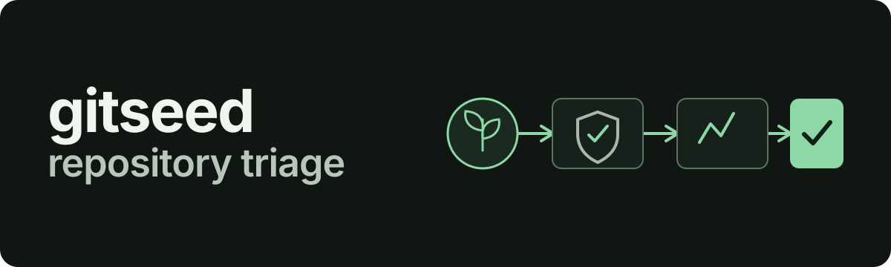

# gitseed

<p align="center">
  
</p>

gitseed finds GitHub repositories, screens the files it can read for deterministic security signals, and grades survivors with a local model.

It presents a ranked review queue for a human to decide one item at a time. `--dry-run` is the default.

An incomplete run is not presented as a quiet one: collection limits, file-reading failures, and model failures remain in the output.

[](https://github.com/MongLong0214/gitseed/actions/workflows/ci.yml)
[](LICENSE)
[](.github/workflows/ci.yml)

## Approval is an argument, not a check

The external-write functions in [`gitseed/review/actions.py`](gitseed/review/actions.py) require an `Approval` value:

```python
def star(client: GitHubWriter, repo: str, approval: Approval) -> Performed:
def follow(client: GitHubWriter, user: str, approval: Approval) -> Performed:
```

The production CLI gets that value from `collect_approval()`, which refuses non-TTY input and reads a terminal decision. A branch such as `if approved:` can disappear; the required argument remains at every `star()` and `follow()` call. The review path records the decision as CommitLore trailers.

No live star or follow has been performed by this code.

## Quick start: replay the fixture

This command needs no network and no GitHub token. It replays the checked-in candidates and grades:

```sh
python3 -m gitseed run --query x --fixtures tests/fixtures
```

The replay prints the ranked clean fixture and withholds the malicious fixture after deterministic screening. For a live run, model selection uses `OLLAMA_MODEL` when set; otherwise it chooses the first installed preferred model in this order: `qwen2.5-coder:32b`, `qwen2.5-coder:7b`, `qwen2.5-coder:1.5b`.

## What it does not do yet

- The review queue has not completed a full live cycle: final approval needs a real TTY. See [Backlog #5](https://github.com/MongLong0214/gitseed/issues/5).
- The forbidden-resource 403 branch has only been exercised with injected responses, not a live API response. See [Backlog #6](https://github.com/MongLong0214/gitseed/issues/6).

## How the work is structured

The pipeline is [F1 collection](docs/tickets/F1-collect.md) → [F2 deterministic screening](docs/tickets/F2-screen.md) → [F3 local-model grading](docs/tickets/F3-grade.md) → [F4 human review](docs/tickets/F4-review.md). The [ticket index](docs/tickets/TICKETS.md) records that order and its dependencies.

Decisions worth keeping are stored as [CommitLore trailers](AGENTS.md). The observed branch layout is `dev` for current work and `main` alongside it for released work.

`phase-gate.py` is not present in this checkout or its Git history, so this README does not claim a phase-gate workflow that cannot be inspected.

## Development checks

CI runs the test suite, the fixture replay, and bytecode compilation on Python 3.9, 3.11, and 3.13.

```sh
python3 -m pytest tests/ -q
python3 -m gitseed run --query x --fixtures tests/fixtures
python3 -m compileall gitseed
```

## License

[MIT](LICENSE)
